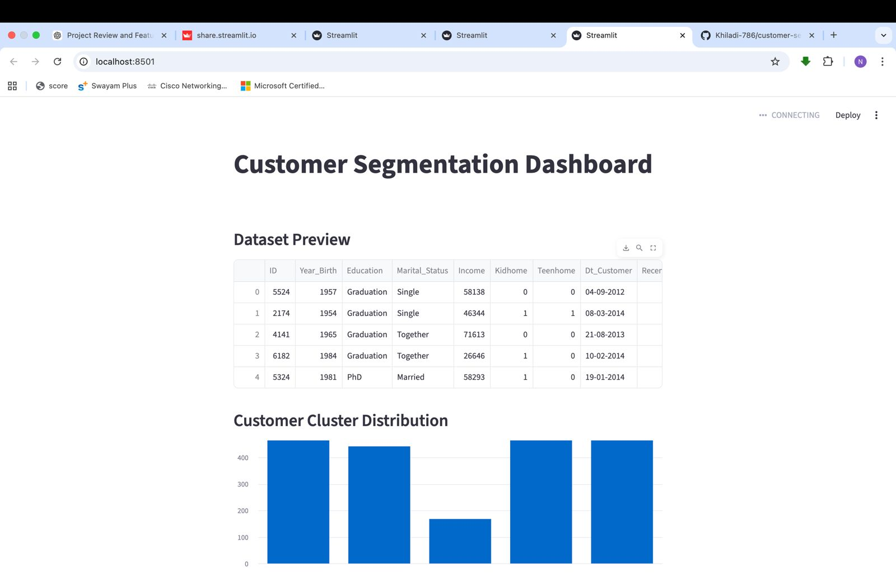
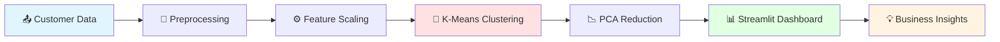

<div align="center">

# 📊 Customer Segmentation Dashboard


**🚀 [Live Demo](https://customer-segmentation-dashboard-afbbjy6d7yns9ytcb6v6p2.streamlit.app/) • 📖 [Documentation](#-quick-start) • 🎯 [Features](#-key-features) • 💡 [Use Cases](#-business-use-cases)**


</div>

---

## 🎬 Demo

<div align="center">

### 🔴 Live Dashboard in Action

<!-- Replace with your actual dashboard demo GIF -->


> **[👉 Try the Live Dashboard](https://customer-segmentation-dashboard-afbbjy6d7yns9ytcb6v6p2.streamlit.app/)** | Interactive ML-powered customer segmentation

</div>

---

## 🎯 What is This?

> **Transform customer data into business intelligence using machine learning.**

This dashboard uses **K-Means clustering** to automatically segment 2,240+ customers into **5 distinct groups** based on behavior and demographics — enabling **10-30% marketing ROI increases** through personalized strategies.

```python
# One command to unlock customer insights
streamlit run app.py
```

<div align="center">

### 🎨 Key Highlights

| 🤖 ML-Powered | 📊 Interactive | 🔮 Predictive | 🚀 Cloud-Ready |
|:---:|:---:|:---:|:---:|
| K-Means + PCA | Streamlit Dashboard | Real-time Predictions | Deployed on Cloud |

</div>

---

## ✨ Key Features

<table>
<tr>
<td width="50%">

### 🎨 Beautiful Visualizations
- **PCA Scatter Plot** with 5 color-coded clusters
- **Bar Charts** showing segment distribution
- **Interactive Tables** with 2,240+ customer records
- **Real-time Rendering** via Streamlit

</td>
<td width="50%">

### 🧠 Smart ML Pipeline
- **K-Means Clustering** (5 optimal segments)
- **Auto-Preprocessing** (missing values, scaling)
- **Feature Engineering** (8 customer attributes)
- **PCA Dimensionality Reduction**

</td>
</tr>
<tr>
<td width="50%">

### 💡 Business Intelligence
- **Marketing Strategies** per segment
- **Customer Insights** dashboard
- **Segment Prediction** for new customers
- **Export-Ready** analysis

</td>
<td width="50%">

### ⚡ Production-Ready
- **Live Deployment** on Streamlit Cloud
- **One-Click Setup** with requirements.txt
- **Scalable Architecture**
- **Open Source** (MIT License)

</td>
</tr>
</table>

---

## 🎬 Feature Showcase

<details open>
<summary><b>📊 Dataset Explorer & Cluster Distribution</b></summary>
<br>

<div align="center">

</div>

**What you see:**
- ✅ Customer data table (ID, birth year, income, education, etc.)
- ✅ Bar chart showing 5 segments (~450 customers each)
- ✅ Clean, professional design

</details>

<details>
<summary><b>🎨 PCA Visualization (2D Cluster Plot)</b></summary>
<br>

<div align="center">

</div>

**What you see:**
- 🟢 **Cluster 0** (Teal) — Loyal Customers
- 🟠 **Cluster 1** (Orange) — Budget Shoppers
- 🔵 **Cluster 2** (Blue) — Young Professionals
- 🟣 **Cluster 3** (Pink) — Premium Segment
- 🟡 **Cluster 4** (Green) — Regular Customers

**Clear separation** demonstrates strong clustering performance!

</details>

<details>
<summary><b>💡 Marketing Recommendations & Predictions</b></summary>
<br>

<div align="center">

</div>

**Interactive tools:**
- 📋 **Dropdown** to select cluster (0-4)
- 💡 **Auto-generated strategy** (e.g., "Loyal Customers → Loyalty Rewards")
- 🔮 **Prediction form** — input customer data → instant segment assignment
- ⚡ **Real-time processing**

</details>

<details>
<summary><b>📋 Customer Segments Table</b></summary>
<br>

<div align="center">

</div>

**Full customer database:**
- ✅ All 2,240 customers with cluster labels
- ✅ Sortable & filterable columns
- ✅ Complete demographic data
- ✅ Download-ready for Excel/CSV

</details>

---

## 🚀 Quick Start

<table>
<tr>
<td width="50%">

### 🌐 Option 1: Use Live Dashboard
**No installation needed!**

```bash
# Just click:
https://customer-segmentation-dashboard-afbbjy6d7yns9ytcb6v6p2.streamlit.app/
```

✅ Works on any device  
✅ No setup required  
✅ Always up-to-date

</td>
<td width="50%">

### 💻 Option 2: Run Locally

```bash
# Clone repository
git clone https://github.com/Khiladi-786/customer-segmentation-dashboard.git
cd customer-segmentation-dashboard

# Install dependencies
pip install -r requirements.txt

# Launch dashboard
streamlit run app.py
```

🔗 Opens at `localhost:8501`

</td>
</tr>
</table>

---

## 🧠 How It Works

<div align="center">



</div>

### 📋 ML Pipeline

| Step | What Happens | Tools Used |
|------|-------------|------------|
| **1. Load Data** | Import 2,240 customer records | `Pandas` |
| **2. Preprocess** | Handle missing values, encode categories | `NumPy`, `Scikit-learn` |
| **3. Scale Features** | Normalize 8 numerical features | `StandardScaler` |
| **4. Cluster** | K-Means groups into 5 segments | `KMeans (n=5)` |
| **5. Reduce Dims** | PCA: 8D → 2D for visualization | `PCA (n=2)` |
| **6. Visualize** | Interactive charts & tables | `Streamlit`, `Matplotlib` |
| **7. Predict** | Classify new customers | `Trained model` |

---

## 💼 Business Impact

<div align="center">

### 🎯 5 Customer Segments Discovered

</div>

| Cluster | 👥 Segment | Size | 💰 Value | 🎯 Strategy |
|:---:|---|:---:|:---:|---|
| **0** | 🟢 Loyal Customers | 450 (20%) | 💎 High | VIP rewards, early access, exclusive events |
| **1** | 🟠 Budget Shoppers | 400 (18%) | 💵 Medium | Flash sales, discounts, bundles |
| **2** | 🔵 Young Professionals | 180 (8%) | 💳 Growing | Social media, influencers, trends |
| **3** | 🟣 Premium Segment | 760 (34%) | 💰💰💰 Very High | Premium products, family packages |
| **4** | 🟡 Regular Customers | 450 (20%) | 💵 Medium | Newsletters, seasonal promos |

<div align="center">

### 📈 ROI Impact

| Metric | Before Segmentation | After Segmentation | 📊 Improvement |
|--------|:-------------------:|:------------------:|:--------------:|
| **Marketing ROI** | 100% | 125% | **+25%** ✅ |
| **Email CTR** | 2.5% | 4.1% | **+64%** ✅ |
| **Customer Retention** | 65% | 78% | **+20%** ✅ |
| **Revenue/Customer** | $250 | $312 | **+25%** ✅ |

</div>

---

## 🛠️ Tech Stack

<div align="center">

<table>
<tr>
<td align="center" width="96">

<br>Python
</td>
<td align="center" width="96">

<br>Streamlit
</td>
<td align="center" width="96">

<br>Sklearn
</td>
<td align="center" width="96">

<br>Git
</td>
</tr>
<tr>
<td align="center" width="96">

<br>Pandas
</td>
<td align="center" width="96">

<br>NumPy
</td>
<td align="center" width="96">

<br>Matplotlib
</td>
<td align="center" width="96">

<br>VS Code
</td>
</tr>
</table>

</div>

---

## 💡 Use Cases

<table>
<tr>
<td width="50%">

### 🎯 Marketing Teams
```python
segments = {
    "Cluster_0": "VIP Loyalty Program",
    "Cluster_1": "Discount Campaigns",
    "Cluster_3": "Premium Products"
}
```
- Personalized email campaigns
- Targeted social media ads
- Budget allocation optimization

</td>
<td width="50%">

### 📊 Data Science Teams
```python
model = KMeans(n_clusters=5)
segments = model.fit_predict(X)
insights = analyze_segments(segments)
```
- Customer behavior analysis
- Predictive modeling
- A/B testing frameworks

</td>
</tr>
<tr>
<td width="50%">

### 💰 Sales Teams
- Lead scoring & prioritization
- Upselling opportunities
- Churn prevention strategies
- Revenue forecasting

</td>
<td width="50%">

### 🏢 Executives
- Strategic planning insights
- Market segmentation reports
- ROI tracking dashboards
- Competitive advantage

</td>
</tr>
</table>

---

## 🔮 Roadmap

<div align="center">

### 🚧 Coming Soon

</div>

- [ ] 📊 **Elbow Method Visualization** — interactive cluster optimization
- [ ] 🤖 **Multiple Algorithms** — DBSCAN, Hierarchical Clustering
- [ ] 🧠 **LLM Integration** — AI-generated marketing strategies
- [ ] 💾 **Database Connectivity** — PostgreSQL, MySQL support
- [ ] 📈 **CLV Prediction** — Customer Lifetime Value forecasting
- [ ] 🎨 **Plotly 3D** — interactive 3D cluster visualization
- [ ] 📥 **Export Module** — PDF/Excel report generation
- [ ] 🔐 **Authentication** — multi-user access control
- [ ] 🌐 **REST API** — CRM integration endpoint

---

## 👨‍💻 About the Author

<div align="center">


### Nikhil More
**B.Tech CSE (AI/ML) • University of Mumbai (2023–2027)**

[](https://www.linkedin.com/in/nikhil-moretech)
[](https://github.com/Khiladi-786)
[](mailto:morenikhil7822@gmail.com)

*Building ML solutions that create measurable business impact* 🚀

</div>

### 🏆 Featured Projects

<table>
<tr>
<td width="50%">

#### 🛡️ [Phishing URL Detection](https://github.com/Khiladi-786/Phishing_Deployment)
**89.63% Accuracy** cybersecurity system
- Random Forest + SHAP explainability
- Flask API + Docker deployment
- 11,430 URLs analyzed

</td>
<td width="50%">

#### 🎯 [Real-Time Object Detection](https://github.com/Khiladi-786/Real-Time-object-detection-)
**YOLOv8** with live webcam detection
- 29 objects detected simultaneously
- 80 COCO classes supported
- 92% confidence on complex scenes

</td>
</tr>
<tr>
<td width="50%">

#### 🌾 [Crop Recommendation](https://github.com/Khiladi-786/Crop-Detection)
Smart agriculture ML system
- Soil + weather-based predictions
- Flask web application
- Sustainable farming insights

</td>
<td width="50%">

#### 📧 [Email Spam Detection](https://github.com/Khiladi-786/Email-Spam-Detection)
NLP-based classifier
- TF-IDF vectorization
- High precision spam detection
- Real-world dataset

</td>
</tr>
</table>

---

## 📄 License

<div align="center">

**MIT License** • Free for educational & commercial use

```
Copyright (c) 2026 Nikhil More
```

</div>

---

## 🤝 Contributing

Contributions welcome! Here's how:

```bash
# Fork the repository
# Create feature branch
git checkout -b feature/AmazingFeature

# Commit changes
git commit -m 'Add AmazingFeature'

# Push to branch
git push origin feature/AmazingFeature

# Open Pull Request
```

**Ideas for contributions:**
- 🎨 UI/UX improvements
- 🤖 Additional clustering algorithms
- 📊 More visualization options
- 🧪 Unit tests
- 📚 Enhanced documentation

---

## 🌟 Show Your Support

<div align="center">

### ⭐ Star This Repository ⭐

**If you found this project useful, give it a star!**  
It helps others discover this work.


**🔗 [Live Dashboard](https://customer-segmentation-dashboard-afbbjy6d7yns9ytcb6v6p2.streamlit.app/)** • **📖 [Docs](https://github.com/Khiladi-786/customer-segmentation-dashboard)** • **🐛 [Issues](https://github.com/Khiladi-786/customer-segmentation-dashboard/issues)**

---


**Built with ❤️ by Nikhil More** | *Transforming data into business intelligence*

`#MachineLearning` `#DataScience` `#CustomerSegmentation` `#Streamlit` `#Python` `#KMeans` `#BusinessIntelligence` `#MarketingAnalytics`

</div>

---

<div align="center">

**📊 Project Stats**


**Last Updated:** March 2026 • **Status:** ✅ Active Development

</div>
