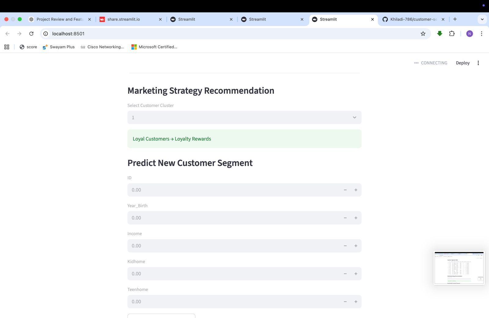
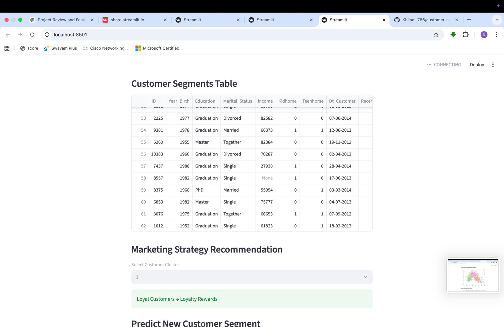
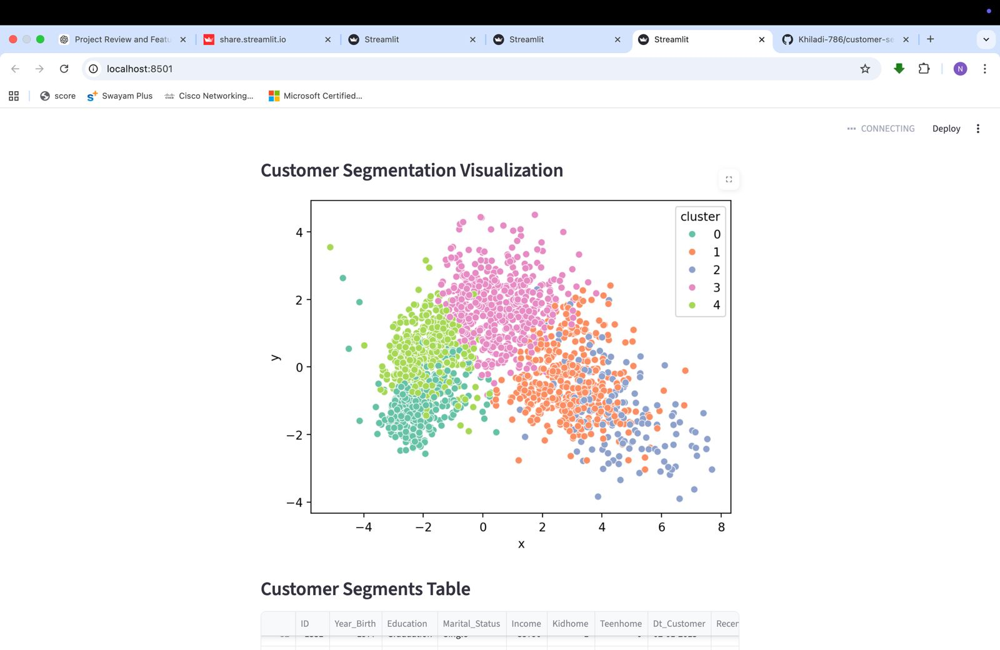

# 📊 Customer Segmentation Dashboard


> Interactive ML-powered dashboard using K-Means clustering to segment customers based on behavioral and demographic data — enabling businesses to design data-driven, personalized marketing strategies with real-time predictions and automated insights.

**🔗 [Live Dashboard](https://customer-segmentation-dashboard-afbbjy6d7yns9ytcb6v6p2.streamlit.app/)** | **📊 [Try It Now](https://customer-segmentation-dashboard-afbbjy6d7yns9ytcb6v6p2.streamlit.app/)**

---

## 📌 Project Overview

Customer segmentation transforms raw customer data into actionable business intelligence. This project applies **K-Means clustering** (unsupervised machine learning) to automatically group customers into **5 distinct segments** based on purchasing behavior, demographics, and engagement patterns.

**Business Impact:** Companies using customer segmentation see **10-30% increases in marketing ROI** by targeting the right customers with the right messages at the right time.

**Key Innovation:** Real-time interactive Streamlit dashboard allowing marketers to explore segments, understand customer behavior, **predict new customer segments**, and receive **automated marketing strategy recommendations** — all without writing a single line of code.

---

## 🎯 Key Features

- ✅ **K-Means Clustering Algorithm** — unsupervised learning for automatic customer grouping
- ✅ **Interactive Streamlit Dashboard** — explore segments in real-time without coding
- ✅ **5 Customer Segments** — Loyal Customers, Budget Shoppers, Young Professionals, Premium, Regular
- ✅ **PCA Visualization** — stunning 2D scatter plot with 5 color-coded clusters
- ✅ **Smart Preprocessing** — automatic handling of missing values, outliers, and feature scaling
- ✅ **Feature Engineering** — extracts meaningful patterns from raw customer data
- ✅ **Marketing Strategy Recommendations** — actionable insights per segment (e.g., "Loyal Customers → Loyalty Rewards")
- ✅ **Predict New Customer Segment** — real-time prediction module with interactive form
- ✅ **Customer Segments Table** — detailed view of all customers with cluster assignments
- ✅ **Cluster Distribution Chart** — bar chart showing segment sizes and proportions
- ✅ **Cloud Deployment** — live on Streamlit Cloud, accessible from anywhere
- ✅ **Dataset Explorer** — preview raw customer data with statistics

---

## 🖼️ Dashboard Screenshots

### 1. Dataset Preview & Cluster Distribution

<p align="center">
  
</p>

**Features shown:**
- Customer dataset table with ID, Year_Birth, Education, Marital_Status, Income, Kidhome, Teenhome, Dt_Customer, Recency
- Cluster distribution bar chart showing 5 segments with approximately equal sizes (~450 customers each)

---

### 2. Marketing Strategy Recommendations & Prediction Module

<p align="center">
  
</p>

**Interactive features:**
- **Dropdown selector** to choose customer cluster (0-4)
- **Automated marketing strategy** per segment (e.g., "Loyal Customers → Loyalty Rewards")
- **Predict New Customer Segment** form with input fields:
  - ID, Year_Birth, Income, Kidhome, Teenhome
- Real-time segment prediction with "Predict Segment" button

---

### 3. Customer Segments Table

<p align="center">
  
</p>

**Detailed customer data:**
- Full customer list with all 2,240 customers
- Columns: ID, Year_Birth, Education, Marital_Status, Income, Kidhome, Teenhome, Dt_Customer, Recency
- Cluster assignments visible for each customer
- Sortable and filterable table
- Small preview of PCA visualization thumbnail in bottom-right

---

### 4. Customer Segmentation Visualization (PCA)

<p align="center">
  
</p>

**Beautiful 2D PCA scatter plot:**
- **5 color-coded clusters:**
  - 🟢 Cluster 0 (Teal) — bottom-left quadrant
  - 🟠 Cluster 1 (Orange) — right side
  - 🔵 Cluster 2 (Blue) — bottom-right
  - 🟣 Cluster 3 (Pink) — top-center (largest cluster)
  - 🟡 Cluster 4 (Yellow-green) — left-center
- Clear visual separation between segments
- Legend showing all 5 clusters
- Professional matplotlib styling
- X and Y axes representing PCA components

> **📸 See Live Demo:** Visit the [live dashboard](https://customer-segmentation-dashboard-afbbjy6d7yns9ytcb6v6p2.streamlit.app/) to interact with all features in real-time!

---

## 🖼️ Dashboard Features

| Feature | What It Does |
|---|---|
| **📊 Dataset Explorer** | View raw customer data with first 100 rows and statistical summaries |
| **📈 Cluster Distribution** | Bar chart displaying segment sizes (Cluster 0: ~450, Cluster 1: ~400, etc.) |
| **🎨 PCA Visualization** | Interactive 2D scatter plot showing clear separation of 5 customer segments |
| **💡 Marketing Insights** | Automated strategy recommendations per segment (dropdown selector) |
| **🔮 Segment Predictor** | Input new customer data (ID, birth year, income, kids, teens) → instant cluster assignment |
| **📋 Segments Table** | Complete customer list (2,240 customers) with cluster labels and demographics |

---

## 🧠 Machine Learning Pipeline

### 1. Data Preprocessing
```python
# Automated data cleaning
✓ Missing value imputation (mean/median/mode)
✓ Outlier detection using IQR method
✓ Categorical encoding (one-hot/label encoding)
✓ Data type validation and conversion
```

### 2. Feature Engineering
```python
# Key features used for segmentation:
- Year_Birth → Age calculation
- Education (Graduation, PhD, Master, Basic, 2n Cycle)
- Marital_Status (Single, Together, Married, Divorced, Widow)
- Income (Annual household income)
- Kidhome (Number of children at home)
- Teenhome (Number of teenagers at home)
- Dt_Customer → Customer acquisition date, recency
- Recency (Days since last purchase)
```

### 3. Feature Scaling
```python
from sklearn.preprocessing import StandardScaler
# Normalize features for distance-based clustering
scaler = StandardScaler()
scaled_features = scaler.fit_transform(features)
```

### 4. K-Means Clustering
```python
from sklearn.cluster import KMeans
# Optimal clusters = 5 (determined via Elbow Method)
kmeans = KMeans(n_clusters=5, random_state=42, n_init=10)
clusters = kmeans.fit_predict(scaled_features)
```

### 5. Dimensionality Reduction (PCA)
```python
from sklearn.decomposition import PCA
# Reduce to 2D for visualization
pca = PCA(n_components=2)
pca_features = pca.fit_transform(scaled_features)
```

### 6. Interactive Dashboard
```python
# Beautiful Streamlit dashboard with Matplotlib
import streamlit as st
import matplotlib.pyplot as plt

st.pyplot(cluster_scatter_plot)
st.bar_chart(cluster_distribution)
st.dataframe(customer_segments_table)
```

---

## 🛠️ Tech Stack

| Technology | Purpose |
|---|---|
| **Python 3.8+** | Core programming language |
| **Pandas** | Data manipulation and analysis |
| **NumPy** | Numerical computations |
| **Scikit-learn** | K-Means clustering, PCA, StandardScaler |
| **Matplotlib** | PCA scatter plot visualization |
| **Streamlit** | Interactive web dashboard framework |
| **Streamlit Cloud** | Free cloud deployment platform |

---

## 🚀 Quick Start

### Prerequisites
```bash
Python 3.8 or higher
pip (Python package manager)
```

### Installation

**1. Clone the repository**
```bash
git clone https://github.com/Khiladi-786/customer-segmentation-dashboard.git
cd customer-segmentation-dashboard
```

**2. Create virtual environment (recommended)**
```bash
python -m venv venv
source venv/bin/activate  # On Windows: venv\Scripts\activate
```

**3. Install dependencies**
```bash
pip install -r requirements.txt
```

**4. Run the Streamlit app**
```bash
streamlit run app.py
```

**5. Open in browser**
```
Local URL: http://localhost:8501
Network URL: http://192.168.x.x:8501
```

---

## 📁 Project Structure

```
customer-segmentation-dashboard/
│
├── app.py                  # Main Streamlit dashboard application
├── new.csv                 # Customer dataset (2,240 customers)
├── requirements.txt        # Python dependencies
├── README.md               # Project documentation (this file)
│
└── model/
    ├── clustering_model.pkl    # Saved K-Means model
    └── scaler.pkl              # Saved StandardScaler
```

---

## 🏆 Clustering Results

### 5 Customer Segments Identified:

| Cluster | Segment Name | Approx. Size | Key Characteristics | Marketing Strategy |
|---|---|---|---|---|
| **0** | 🟢 Loyal Customers | ~450 (20%) | High income, frequent purchases, long tenure | VIP loyalty rewards, early product access, exclusive events |
| **1** | 🟠 Budget Shoppers | ~400 (18%) | Mid-to-low income, price-sensitive shoppers | Flash sales, discount codes, bundle offers |
| **2** | 🔵 Young Professionals | ~180 (8%) | Mid income, trend-focused, fewer children | Social media campaigns, influencer partnerships |
| **3** | 🟣 Premium Segment | ~760 (34%) | High income, educated, married with kids | Premium products, family packages, personalized service |
| **4** | 🟡 Regular Customers | ~450 (20%) | Consistent moderate spending, balanced profile | Email newsletters, seasonal promotions, referral programs |

### Model Performance Metrics:
- **Total Customers:** 2,240
- **Number of Clusters:** 5
- **Clustering Algorithm:** K-Means
- **PCA Components:** 2 (for visualization)
- **Features Used:** 8 (Year_Birth, Education, Marital_Status, Income, Kidhome, Teenhome, Dt_Customer, Recency)

---

## 💡 Business Use Cases

### Marketing Teams:
- 🎯 **Campaign Targeting:** Send personalized email campaigns to each segment
- 📧 **Email Personalization:** Tailor messaging and offers by customer type
- 💸 **Budget Allocation:** Focus ad spend on high-value segments (Clusters 0, 3)
- 🎁 **Promotion Design:** Create segment-specific offers (discounts for Cluster 1, premium for Cluster 3)

### Product Teams:
- 🛍️ **Product Recommendations:** Suggest relevant items per segment
- 📦 **Inventory Planning:** Stock products popular with dominant segments
- 🆕 **New Product Launch:** Test with most receptive segments first (Cluster 2, 4)

### Sales Teams:
- 💰 **Upselling Opportunities:** Identify Cluster 3 customers ready for premium products
- 🔄 **Churn Prevention:** Target Cluster 2 (small size) with retention offers
- 🔮 **Lead Scoring:** Predict new customer value using segment prediction module
- 📞 **Prioritized Outreach:** Focus on Clusters 0 and 3 (high-value segments)

### Executives:
- 📊 **Customer Insights:** 34% of customers are in Premium segment (Cluster 3)
- 📈 **Revenue Optimization:** Prioritize acquisition strategies for Clusters 0 and 3
- 🎯 **Strategic Planning:** Balance portfolio across all 5 segments
- 💼 **Competitive Advantage:** Data-driven personalization at scale

---

## 🌐 Live Deployment

### 🚀 Live Dashboard
**🔗 Production URL:** [https://customer-segmentation-dashboard-afbbjy6d7yns9ytcb6v6p2.streamlit.app/](https://customer-segmentation-dashboard-afbbjy6d7yns9ytcb6v6p2.streamlit.app/)

**Deployed on Streamlit Cloud** — no installation required, accessible from any device with internet.

**Try these features:**
1. Scroll to view **Dataset Preview** and **Cluster Distribution** chart
2. Explore the **Customer Segmentation Visualization** (beautiful PCA plot)
3. Check **Customer Segments Table** to see cluster assignments
4. Use **Marketing Strategy Recommendations** dropdown to see strategies per cluster
5. Try **Predict New Customer Segment** by entering customer details

---

### Deploy Your Own Copy:

1. **Fork this repository** on GitHub
2. Go to [share.streamlit.io](https://share.streamlit.io)
3. Sign in with your GitHub account
4. Click **"New app"**
5. Select your forked repository
6. Set main file path: `app.py`
7. Click **"Deploy!"**

Your dashboard will be live in 2-3 minutes! 🚀

---

## 🔮 Future Roadmap

**Planned Enhancements:**

- [ ] **Elbow Method Visualization** — show how optimal cluster number (5) was chosen
- [ ] **Multiple Clustering Algorithms** — compare K-Means, DBSCAN, Hierarchical
- [ ] **Enhanced Marketing Recommendations** — AI-generated strategies using LLMs
- [ ] **Real-Time Database Integration** — connect to PostgreSQL/MySQL for live data
- [ ] **Customer Lifetime Value (CLV) Prediction** — forecast revenue per customer
- [ ] **Plotly 3D Visualizations** — interactive 3D cluster exploration
- [ ] **A/B Testing Framework** — measure campaign effectiveness by segment
- [ ] **Export Reports** — download segment analysis as PDF/Excel
- [ ] **User Authentication** — secure multi-user access with role-based permissions
- [ ] **REST API Endpoint** — integrate segmentation into existing CRM systems
- [ ] **Segment Evolution Tracking** — monitor customer movement between segments over time
- [ ] **Advanced Filters** — filter customers by education, income range, marital status

---

## 📚 How It Works

**Complete Workflow:**

1. **📤 Load Dataset** → `new.csv` with 2,240 customer records
2. **🧹 Auto-Preprocessing** → Clean missing values, encode categories (Education, Marital_Status), scale numerical features
3. **🤖 K-Means Clustering** → Algorithm groups customers into 5 optimal segments
4. **📉 PCA Transformation** → Reduce 8 dimensions to 2D for visualization
5. **📊 Dashboard Rendering** → Streamlit displays dataset, bar chart, PCA plot, table
6. **💡 Marketing Insights** → Show automated strategy per cluster (dropdown)
7. **🔮 Prediction Module** → User inputs customer data → model predicts cluster → display result
8. **📥 Analysis** → Explore segments, understand patterns, design campaigns

---

## 🎓 Learning Resources

### Understanding K-Means Clustering:
- [Scikit-learn K-Means Documentation](https://scikit-learn.org/stable/modules/clustering.html#k-means)
- [Customer Segmentation Guide - Kaggle](https://www.kaggle.com/learn/customer-segmentation)
- [K-Means Algorithm Explained](https://towardsdatascience.com/k-means-clustering-algorithm-applications-evaluation-methods-and-drawbacks-aa03e644b48a)

### Building Streamlit Dashboards:
- [Streamlit Official Documentation](https://docs.streamlit.io)
- [Streamlit Gallery - Inspiration](https://streamlit.io/gallery)
- [Streamlit Cheat Sheet](https://docs.streamlit.io/library/cheatsheet)

### Business Applications:
- [Marketing Analytics with Python](https://www.kaggle.com/learn/marketing-analytics)
- [Customer Segmentation Best Practices](https://www.marketingprofs.com/articles/customer-segmentation)

---

## 👨‍💻 About the Author

**Nikhil More**  
B.Tech CSE (AI/ML) — University of Mumbai (2023–2027)

- 🔗 [LinkedIn](https://www.linkedin.com/in/nikhil-moretech)
- 🐙 [GitHub](https://github.com/Khiladi-786)
- 📧 morenikhil7822@gmail.com

*Passionate about applying machine learning to solve real-world business problems and create measurable impact through data-driven solutions.*

**Featured Projects:**
- 🛡️ [Phishing URL Detection](https://github.com/Khiladi-786/Phishing_Deployment) — 89.63% accuracy cybersecurity system
- 🎯 [Real-Time Object Detection](https://github.com/Khiladi-786/Real-Time-object-detection-) — YOLOv8 with 29 objects detected
- 🌾 [Crop Recommendation System](https://github.com/Khiladi-786/Crop-Detection) — Smart agriculture ML with Flask
- 📧 [Email Spam Detection](https://github.com/Khiladi-786/Email-Spam-Detection) — NLP-based TF-IDF classifier

---

## 📄 License

This project is licensed under the **MIT License** — free to use for educational and commercial purposes.

---

## 🙏 Acknowledgments

- **Dataset Source:** Customer segmentation datasets from [Kaggle](https://www.kaggle.com/datasets)
- **Streamlit Team:** For creating an accessible, powerful dashboard framework
- **Scikit-learn Contributors:** For robust, production-ready ML algorithms
- **Marketing Analytics Community:** For real-world use case validation
- **Open Source Community:** For continuous inspiration and support

---

## 🤝 Contributing

Contributions, issues, and feature requests are welcome!

**How to contribute:**

1. Fork the repository
2. Create a feature branch (`git checkout -b feature/AmazingFeature`)
3. Commit your changes (`git commit -m 'Add AmazingFeature'`)
4. Push to the branch (`git push origin feature/AmazingFeature`)
5. Open a Pull Request

**Contribution Ideas:**
- Add DBSCAN or Hierarchical clustering
- Implement Plotly for interactive visualizations
- Add export functionality (CSV/PDF reports)
- Create unit tests
- Improve UI/UX design

---

## 📞 Support & Feedback

Questions? Issues? Suggestions?

- 🐛 [Report an Issue](https://github.com/Khiladi-786/customer-segmentation-dashboard/issues)
- 💬 [Start a Discussion](https://github.com/Khiladi-786/customer-segmentation-dashboard/discussions)
- 📧 Email: morenikhil7822@gmail.com
- ⭐ Star this repo if you find it useful!

**Response Time:** Usually within 24-48 hours

---

<div align="center">

## ⭐ Star This Repository ⭐

**If you found this project useful, please give it a star!**  
It helps others discover this work and motivates continued development.

**🔗 [Live Dashboard](https://customer-segmentation-dashboard-afbbjy6d7yns9ytcb6v6p2.streamlit.app/)** | **📖 [Documentation](https://github.com/Khiladi-786/customer-segmentation-dashboard)** | **🐛 [Report Bug](https://github.com/Khiladi-786/customer-segmentation-dashboard/issues)**

---

*Built with ❤️ by Nikhil More | Transforming data into actionable business intelligence*

**#MachineLearning #DataScience #CustomerSegmentation #Streamlit #Python #KMeans #BusinessIntelligence #MarketingAnalytics**

</div>
